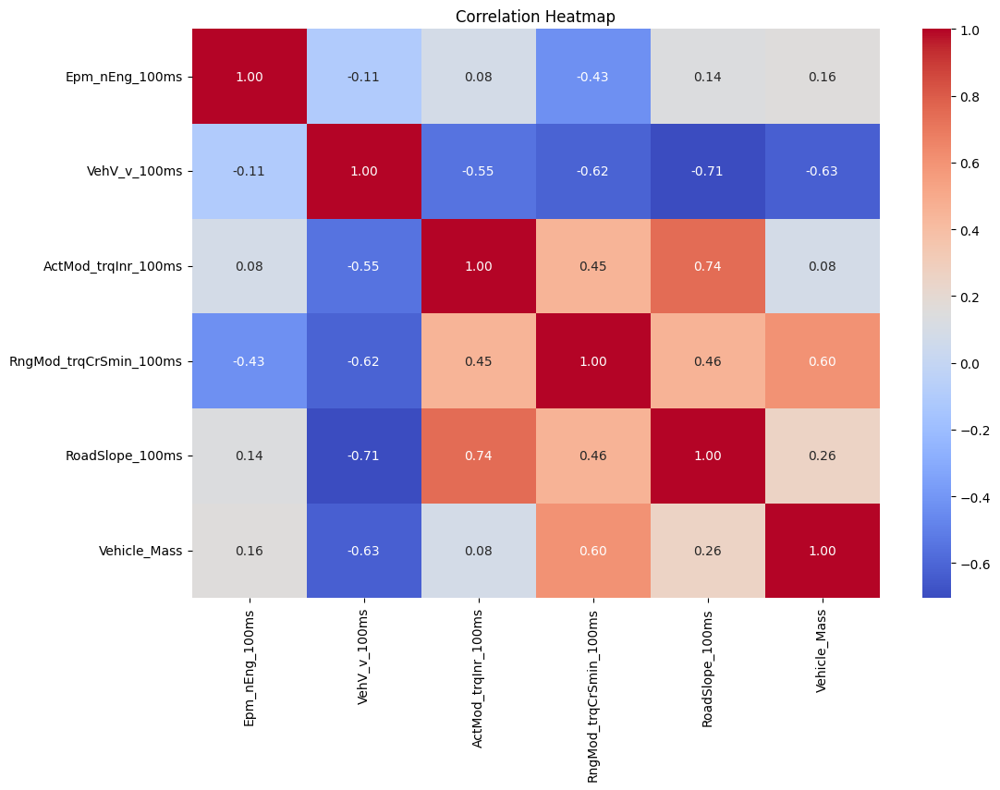
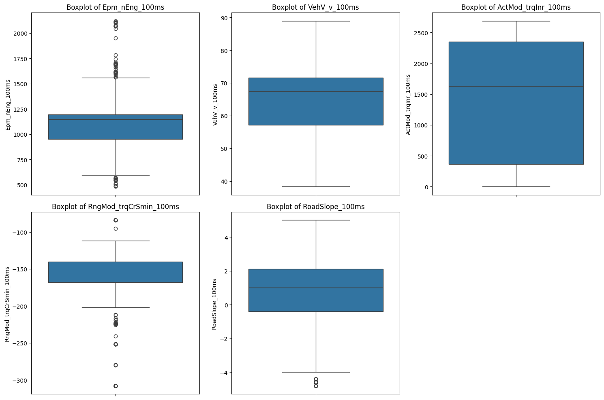
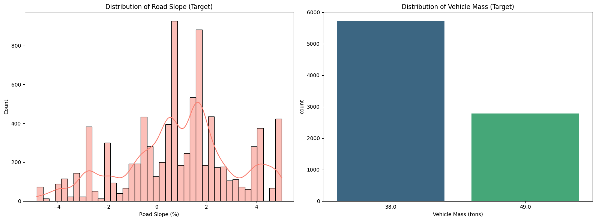
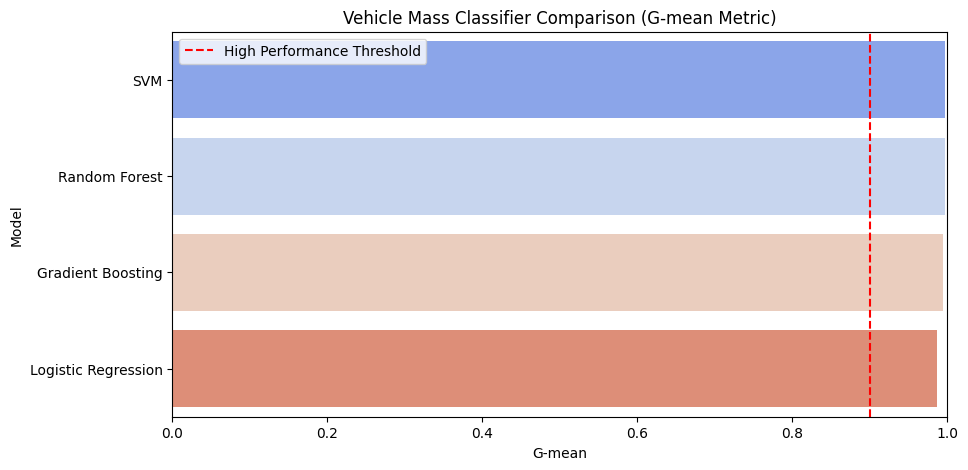
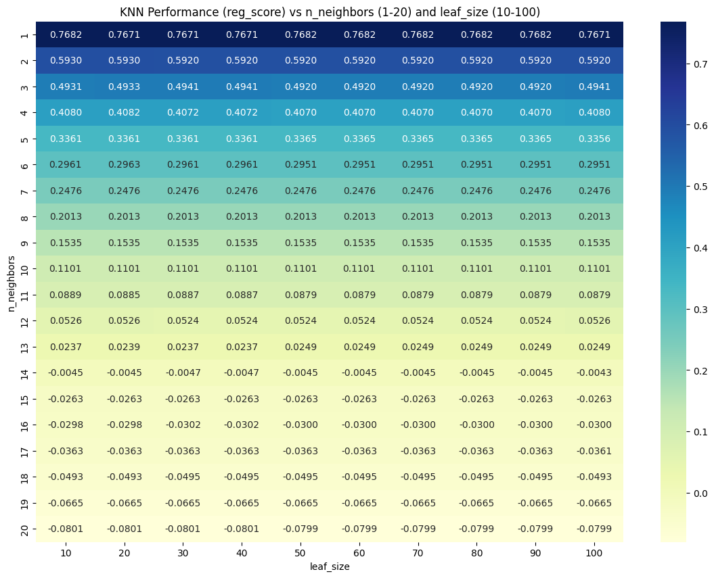

# 🚀 Virtual Vehicle Sensor
*Read this in [Vietnamese 🇻🇳](README_vi.md)*

### Machine Learning System for Road Slope Regression & Vehicle Mass Classification  

**Author:** Phạm Trâm Anh
**Mentor:** Phạm Long Vân – Data Manager  
**Location:** Ho Chi Minh City, Vietnam – 2026 

---

# 🌍 Background Context

## 🚘 Driving Declinometer & Vehicle Weight Estimation

Knowing the weight of a vehicle and the slope of the road would be beneficial for many driver assistance systems. For example, the information could be used to improve power management or plan routes based on weight restrictions.

Unfortunately, installing additional sensors to measure weight and slope directly is expensive. However, vehicles already track properties like engine power and speed that depend strongly on the unknown quantities. These could be used as input for a software "sensor" that is much cheaper than a hardware solution.

**The Core Challenge**: *Can you accurately predict weight and slope using signals that already exist on a vehicle?*

---

## 📊 Dataset Description & System Structure

To address this challenge, the dataset acts as the foundational building block for the software sensor system. It consists of 11 distinct vehicular signals with **no temporal sequence** (order has been scrambled), meaning the predictive system must operate reliably on **individual frames**.

### 1. System Structure
Our architecture acts as a dual-engine **Virtual Sensor**, taking standard internal telemetry as inputs and feeding them simultaneously into:
- A **Regression Engine** (for forecasting continuous road gradients).
- A **Classification Engine** (for deciding discrete mass boundaries).

### 2. Input Metrics (9 Predictors)
These are standard vehicle area network signals utilized directly by the machine learning models:
- `Epm_nEng_100ms`: Average engine speed of one cylinder segment (rpm)
- `VehV_v_100ms`: Vehicle speed (km/h)
- `ActMod_trqInr_100ms`: Current, back-calculated inner engine torque (Nm)
- `RngMod_trqCrSmin_100ms`: Minimum engine torque at the crankshaft level (Nm)
- `CoVeh_trqAcs_100ms`: Torque demand of accessories (Nm)
- `Clth_st_100ms`: Debounced status of clutch (-)
- `CoEng_st_100ms`: Engine operation status (enum: 0 to 5)
- `Com_rTSC1VRVCURtdrTq_100ms`: Desired torque or torque limit (%)
- `Com_rTSC1VRRDTrqReq_100ms`: Torque requested by retarder (%)

**Dataset Preview (df.head())**
| Epm_nEng_100ms | VehV_v_100ms | ActMod_trqInr_100ms | RngMod_trqCrSmin_100ms | CoVeh_trqAcs_100ms | Clth_st_100ms | CoEng_st_100ms | Com_rTSC1VRVCURtdrTq_100ms | Com_rTSC1VRRDTrqReq_100ms | RoadSlope_100ms | Vehicle_Mass |
| :--- | :--- | :--- | :--- | :--- | :--- | :--- | :--- | :--- | :--- | :--- |
| 1000.5 | 45.2 | 120.4 | -15.0 | 9.999747 | 0 | 3 | 0 | 0 | 0.5 | 49 |
| 850.5 | 24.5 | 50.1 | -15.0 | 9.999747 | 0 | 3 | 0 | 0 | 1.2 | 38 |
| 1200.0 | 60.0 | 450.2 | -15.0 | 9.999747 | 0 | 3 | 0 | 0 | -0.2 | 49 |

### 3. Problem Output
- **Vehicle Mass (Classification)**: Constrained and discretized into two exact variants: `38 t` or `49 t`.
- **Road Slope (Regression)**: Represented as actual slope percentage from the ADASIS horizon calculated natively using the function `tan(slope) = RoadSlope_100ms / 100`.

### 4. Practical Applications & Real-World Use Cases
Once the virtual sensor accurately predicts the **Road Slope** and **Vehicle Mass**, these telemetry insights can robustly augment Advanced Driver Assistance Systems (ADAS) and heavy fleet operations natively:
- **Intelligent Power Management & Fuel Efficiency**: Dynamically adjusting engine torque, calculating optimal throttle behavior, and optimizing transmission gear-shifting strategies based on predicted loads and approaching gradients.
- **Dynamic Route Planning**: Aiding navigation systems to automatically recalculate routes avoiding steep inclines or structural bridges restricted to a lighter mass (e.g. bypassing 49-ton loads).
- **Economic Hardware Replacement**: Eliminating the engineering necessity of mounting, calibrating, and maintaining expensive, electronically vulnerable physical declinometers and weight measurement scales.

---

## 📌 Executive Summary

This system acts as a virtual sensor pipeline by systematically ingesting raw vehicle data streams, engineering signals, and mapping these telematics to the actual vehicle mass label. The workflow consists of the following core phases:

- Full **Exploratory Data Analysis (EDA)** to demystify complex mechanical correlations  
- A streamlined **Data Preparation & Feature Engineering** pipeline ensuring stable inputs  
- Robust **Outlier Defense** leveraging scaling methodologies to avoid mechanical sensor noise   
- Evaluated **Modeling (Regression & Classification)** to establish a high-accuracy, deployable virtual sensor  

---

# 1️⃣ Exploratory Data Analysis (EDA)

Conducting EDA is paramount when working with mechanical telemetry due to the varying scaling limits and sensor dropouts in raw environments.

## 🔹 Missing Values Assessment
- Validated the dataset health, confirming **no missing values**. This guarantees pure and consistent initial data without needing to inject arbitrary imputation biases.

```python
# Verify payload continuity across all vehicle frames
missing_stats = df.isnull().sum()
print(f"Total missing values detected: {missing_stats.sum()}")
```
```text
Total missing values detected: 0
```

## 🔹 Feature Correlation
- **Dimensionality Reduction**: Safely dropped 5 signal columns that contained only a single unique value constraint, as they possess zero statistical variance and provide no analytical leverage.

```python
# Identify and drop columns with zero variance (single unique value)
useless_cols = [col for col in df.columns if df[col].nunique() == 1]
print(f"Features with single unique value:\\n{useless_cols}")

df.drop(columns=useless_cols, inplace=True)
print(f"Shape after dropping zero-variance features: {df.shape}")
```
```text
Features with single unique value:
['CoVeh_trqAcs_100ms', 'Clth_st_100ms', 'CoEng_st_100ms', 'Com_rTSC1VRVCURtdrTq_100ms', 'Com_rTSC1VRRDTrqReq_100ms']
Shape after dropping zero-variance features: (8496, 6)
```
- **Feature Correlation Engine**: Identified a strongly significant negative correlation **(-0.62)** between `VehV` and `RngMod`. Concluded grouping these two streams into a `Combined_VehV_RngMod` composite asset.



## 🔹 Outlier Detection & Behavior
- Noticed heavy data skewing on telemetry features (e.g., `RngMod_trqCrSmin_100ms` where median overlaps directly with the first quartile `Q1`).
- Resolved to apply a **RobustScaler** to dampen sensitivities towards extreme values, heavily improving resistance against mechanical error ranges and sensor anomalies.



## 🔹 Class Label Distribution
- To accurately represent testing groups, the final pipeline forcefully requires **stratification (`stratify=y`)** when splitting the data batches, preserving original vehicle mass class proportions.



---

# 2️⃣ Data Preparation & Engineering

With insights mapped from the Analytics phase, the system builds an automated normalization assembly before model entry:

1. **Feature Removing:** Slices off redundant zero-variance sensor data features.
2. **Combine Features:** Structurally integrates and synthesizes highly correlated input metrics.
3. **Data Splitting:** Allocates rigorous partitioned boundaries for training and validations.
4. **Encoding for Classification Label:** Encodes string or mismatched values into a purely numerical format compatible with classification loss parameters.
5. **Scaling:** Systematically applies `RobustScaler` mapping distributions towards stabilized ranges.

---

# 3️⃣ Modeling & Verification

## 🧮 Custom Scoring Logic
The verification process natively requires deterministic performance profiles beyond standard accuracy metrics:
- **Classification Score (G-mean)**: Optimizes class balances mathematically using $\sqrt{Recall_0 \times Recall_1}$.
- **Regression Score**: Implements a tier-based sliding absolute error scaling framework providing heavier penalty thresholds to ensure reliability.

## 🎯 1. Classification Engine (Vehicle Mass)
After evaluating the scaled telemetry across four architectures (*Logistic Regression, Random Forest, Gradient Boosting, SVM*), the **SVM (Support Vector Machine / SVC)** outperformed variants under the G-mean validation framework with a peak performance of **0.9970**.



## 📈 2. Regression Engine (Road Slope)
We continuously optimized parameter bounds via an expanded parameter grid, discovering that standard ensemble trees failed threshold tolerances due to high structural depth.
- The base **KNeighborsRegressor (KNN)** drastically outperformed regression ensembles natively.
- **Optimization Strategy (Multi-tasking)**: To bypass algorithmic limitations, we augmented the regression feature matrix with the `Pred_Vehicle_Mass` output (calculated via our robust SVM framework).
- **Result**: Applying a *KNN (k=1, leaf_size=10)* atop the augmented multi-task matrix pushed the overall prediction edge up to **0.7694**.



---

# 4️⃣ Final System Evaluation & Artifacts

## Final Pipeline Execution (Test Sets)
The selected standard models (`SVC` & `KNN MultiTask`) were deployed on un-indexed test segments to ensure maximum generalizability against real-world mechanical variance.
- **Classification Benchmark (Vehicle Mass)**: `0.9953`
- **Regression Benchmark (Road Slope)**: `0.7543` 
- **Combined Edge Profile Rating**: `1.7496`

## ⚙️ Model Artifacts
Exported structural pipeline elements ready for physical vehicle networking:
- Target Classification Matrix: `svc_vehicle_mass_classifier.joblib`
- Target Regression Matrix: `knn_road_slope_regressor.joblib`
- Structural Filters: `robust_scaler.joblib` / `label_encoder.joblib` 

---

# 🏁 Conclusion

Implementing this project heavily extends beyond baseline predictions; it establishes a directly deployable, end-to-end software telemetry solution. By systematically integrating heavy-duty outlier suppression methodologies with a multi-task optimized dual-model engine (SVC + Augmented KNN), the framework asserts itself as a statistically sound Virtual Sensor—ready to act as a primary computational substitute for expensive mechanical inclination and weight arrays on operational vehicles.
